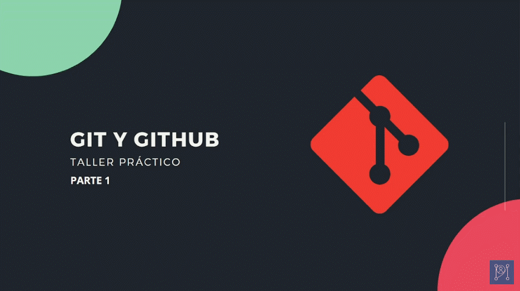

# TALLER PRÁCTICO DE GIT Y GITHUB 🐱‍💻

🐱‍👓 Este repositorio fue desarrollado dentro del taller práctico de Git y GitHub para la comunidad de Paradigma Indie.

En el taller desarrollamos este proyecto con el fin de mostrar de forma práctica el funcionamiento de Git y GitHub.

> ### Contenido
>
> [Parte 1](https://www.youtube.com/watch?v=9Gosip42Q0M)
> > [00:00](https://www.youtube.com/watch?v=9Gosip42Q0M&t=0s) Presentación  
> > [00:40](https://www.youtube.com/watch?v=9Gosip42Q0M&t=40s) ¿Qué es Git?  
> > [01:56](https://www.youtube.com/watch?v=9Gosip42Q0M&t=116s) Ventajas de Git  
> > [05:02](https://www.youtube.com/watch?v=9Gosip42Q0M&t=302s) Diferencia entre Git y GitHub  
> > [06:20](https://www.youtube.com/watch?v=9Gosip42Q0M&t=380s) Cuenta de GitHub  
> > [10:18](https://www.youtube.com/watch?v=9Gosip42Q0M&t=618s) Algunos comandos de consola  
> > [17:07](https://www.youtube.com/watch?v=9Gosip42Q0M&t=1027s) Configuraciones de Git  
> > [20:40](https://www.youtube.com/watch?v=9Gosip42Q0M&t=1240s) Inicializar un repositorio con Git  
> > [22:29](https://www.youtube.com/watch?v=9Gosip42Q0M&t=1349s) Flujo de trabajo  
> > [24:56](https://www.youtube.com/watch?v=9Gosip42Q0M&t=1496s) Archivos y carpetas  
> > [28:29](https://www.youtube.com/watch?v=9Gosip42Q0M&t=1709s) Comandos git add y git status  
> > [32:47](https://www.youtube.com/watch?v=9Gosip42Q0M&t=1967s) Comando git commit  
> > [34:25](https://www.youtube.com/watch?v=9Gosip42Q0M&t=2065s) Comando git log  
> > [42:59](https://www.youtube.com/watch?v=9Gosip42Q0M&t=2579s) Preguntas  
> > [44:35](https://www.youtube.com/watch?v=9Gosip42Q0M&t=2675s) Redes sociales  
>
> [Parte 2 - video 1](https://www.youtube.com/watch?v=CpbI61mOZ0M)
> > [00:00](https://www.youtube.com/watch?v=CpbI61mOZ0M=0s) Presentación  
> > [01:05](https://www.youtube.com/watch?v=CpbI61mOZ0M=65s) Repaso  
> > [02:02](https://www.youtube.com/watch?v=CpbI61mOZ0M=122s) Manejo de cambios  
> > [02:51](https://www.youtube.com/watch?v=CpbI61mOZ0M=171s) Comando git diff  
> > [09:02](https://www.youtube.com/watch?v=CpbI61mOZ0M=542s) Comando git commit --amend  
> > [10:36](https://www.youtube.com/watch?v=CpbI61mOZ0M=636s) Comando git rm  
> > [13:25](https://www.youtube.com/watch?v=CpbI61mOZ0M=805s) Comando git reset  
> > [17:25](https://www.youtube.com/watch?v=CpbI61mOZ0M=1045s) Ramas  
> > [18:30](https://www.youtube.com/watch?v=CpbI61mOZ0M=1110s) Comandos git branch y git checkout  
> > [24:54](https://www.youtube.com/watch?v=CpbI61mOZ0M=1494s) Preparando los archivos para producción  
> > [33:35](https://www.youtube.com/watch?v=CpbI61mOZ0M=2015s) Comando git merge  
>
> [Parte 2 - video 2](https://www.youtube.com/watch?v=FKNMsJtIoyk)
> > [00:00](https://www.youtube.com/watch?v=FKNMsJtIoyk=0s) Presentación  
> > [00:23](https://www.youtube.com/watch?v=FKNMsJtIoyk=23s) Repositorio en GitHub  
> > [02:10](https://www.youtube.com/watch?v=FKNMsJtIoyk=130s) Comando git remote  
> > [06:39](https://www.youtube.com/watch?v=FKNMsJtIoyk=399s) Comandos git push y git pull  
> > [10:40](https://www.youtube.com/watch?v=FKNMsJtIoyk=640s) Comando git tag  
> > [19:05](https://www.youtube.com/watch?v=FKNMsJtIoyk=1145s) Temas de Jekill y GitHub Pages  
> > [24:51](https://www.youtube.com/watch?v=FKNMsJtIoyk=1491s) Comando git clone  
> > [30:14](https://www.youtube.com/watch?v=FKNMsJtIoyk=1814s) Watch, Star y Fork  
> > [31:10](https://www.youtube.com/watch?v=FKNMsJtIoyk=1870s) Pull Request  
> > [36:38](https://www.youtube.com/watch?v=FKNMsJtIoyk=2198s) Despedida  
>
> [Parte 3](https://www.youtube.com/watch?v=x2l6jvBZLCs)
> > [00:00](https://www.youtube.com/watch?v=x2l6jvBZLCs=0s) Presentación  
> > [00:58](https://www.youtube.com/watch?v=x2l6jvBZLCs=58s) Issues  
> > [06:45](https://www.youtube.com/watch?v=x2l6jvBZLCs=405s) Projects  
> > [09:08](https://www.youtube.com/watch?v=x2l6jvBZLCs=548s) Wiki  
> > [13:12](https://www.youtube.com/watch?v=x2l6jvBZLCs=792s) Configuraciones  
> > [13:52](https://www.youtube.com/watch?v=x2l6jvBZLCs=832s) Tag y Release  
> > [18:33](https://www.youtube.com/watch?v=x2l6jvBZLCs=1113s) Versionamiento Semántico  
> > [21:28](https://www.youtube.com/watch?v=x2l6jvBZLCs=1288s) CHANGELOG.md  
> > [28:29](https://www.youtube.com/watch?v=x2l6jvBZLCs=1709s) Badges  
> > [43:23](https://www.youtube.com/watch?v=x2l6jvBZLCs=2603s) Despedida  

## Diapositivas

- [Parte 1](https://www.canva.com/design/DAEbrgXmM7E/2Q1XwqnQg52SebX45aLmow/view?utm_content=DAEbrgXmM7E&utm_campaign=designshare&utm_medium=link&utm_source=sharebutton)
- [Parte 2](https://www.canva.com/design/DAEg58n5MVg/sI2Gx7pDldMBCTWi2Mhj6A/view?utm_content=DAEg58n5MVg&utm_campaign=designshare&utm_medium=link&utm_source=sharebutton)
- [Parte 3](https://www.canva.com/design/DAEhGiiwDsA/atR638aTINmTxKWN1GNZEg/view?utm_content=DAEhGiiwDsA&utm_campaign=designshare&utm_medium=link&utm_source=sharebutton)

## Maestro

- **Manuel Gil** - [ManuelGil](https://github.com/ManuelGil) / [imgildev](https://github.com/imgildev)

